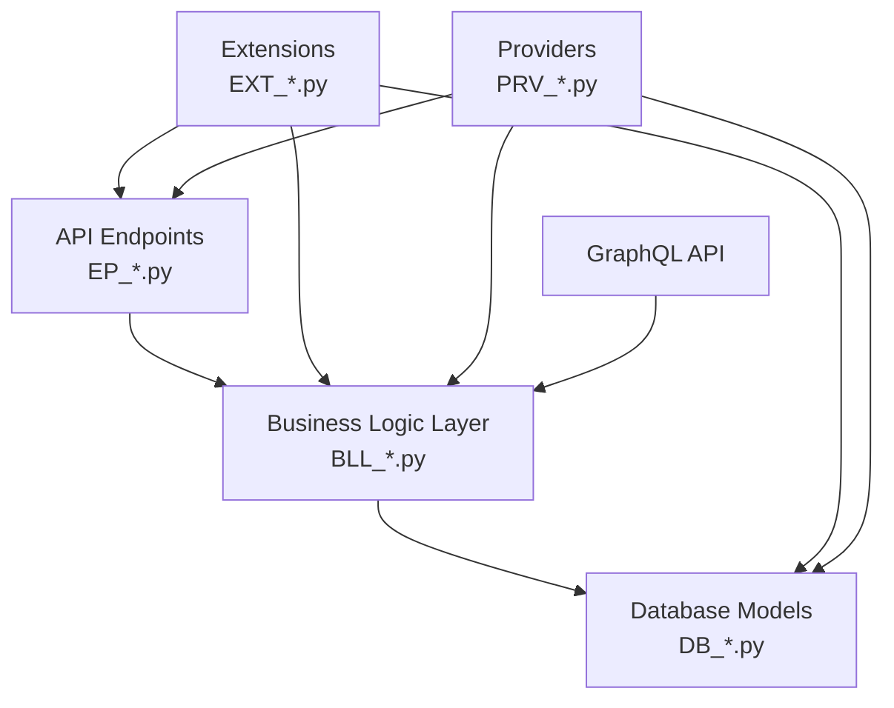

# Architecture Reference

This document provides a comprehensive reference of the server framework architecture, with a focus on endpoints and server runtime. Core functionality is described in detail first, followed by extension functionality that builds upon the core patterns without repeating the foundational concepts.

## System Architecture

This server framework is a modular, extensible platform built with a layered architecture:



### Naming Conventions
- Abstract Classes: "AbstractX.py"
- Static Functions: "StaticX.py"
- Database Files: "DB_X.py"
- Business Logic Files: "BLL_X.py"
- Endpoint Files: "EP_X.py"
- Provider Files: "PRV_X.py"
- Extension Files: "EXT_X.py"
- Service Files: "SVC_X.py"
- Test Files: "Domain_X_test.py"

### Core Design Principles

1. **Layered Architecture**: Each layer has distinct responsibilities with clear interfaces
2. **Extension System**: Core functionality can be extended via extensions
3. **Provider Pattern**: External services are accessed through standardized providers
4. **Manager Pattern**: Business logic is encapsulated in manager classes
5. **Model-Based Validation**: All operations use strongly-typed models
6. **Permission-Based Security**: Fine-grained access control at each level

## Server Runtime and Bootstrapping

### Application Entry Point (Server.py)

The server bootstrap process follows these steps:

1. Configure Python path and environment
2. Import all database models 
3. Set up database connections and apply migrations
4. Initialize application with proper worker configuration
5. Set up Uvicorn server with specified configuration

```python
# Server.py (simplified)
def setup_database():
    """Initialize database and set up default roles."""
    # Set up Python path
    setup_python_path()
    
    # Import all database models dynamically
    import_all_db_models()
    
    # Initialize engine configuration
    db_manager = DatabaseManager.get_instance()
    db_manager.init_engine_config()
    
    # Apply migrations if needed
    check_and_apply_migrations()

if __name__ == "__main__":
    # Set up logging
    setup_enhanced_logging()
    
    # Run database setup once in parent process
    setup_database()
    
    # Seed data if configured
    if str(env("SEED_DATA")).lower() == "true":
        seed_data()
        
    # Start Uvicorn with the app as an import string
    uvicorn.run(
        "app:create_app",
        host="0.0.0.0",
        port=1996,
        workers=int(env("UVICORN_WORKERS")),
        log_level=str(env("LOG_LEVEL")).lower(),
        proxy_headers=True,
        reload=str(env("LOG_LEVEL")).lower() == "debug",
        factory=True,
    )
```

### Application Factory (app.py)

The FastAPI application is created using a factory pattern:

1. Configure environment and logging
2. Set up global exception handler
3. Initialize managers and services
4. Define application lifecycle events
5. Configure CORS middleware
6. Automatically discover and include all EP_* routers
7. Set up GraphQL schema
8. Register health check endpoint

```python
# app.py (simplified)
def create_app():
    """FastAPI application factory function."""
    # Configure environment
    setup_enhanced_logging()
    
    # Set up exception handler
    sys.excepthook = log_unhandled_exception
    
    # Define application lifecycle
    @asynccontextmanager
    async def lifespan(app: FastAPI):
        # Initialize services
        db_manager.init_worker()
        yield
        # Cleanup services
        await db_manager.close_worker()
    
    # Initialize FastAPI application
    app = FastAPI(
        title=env("APP_NAME"),
        description=f"{env('APP_NAME')} is an {env('APP_DESCRIPTION')}...",
        version=version,
        docs_url="/",
        lifespan=lifespan,
    )
    
    # Configure CORS
    app.add_middleware(CORSMiddleware, allow_origins=["*"], ...)
    
    # Discover and include EP_* routers
    for module_path in ep_modules:
        module = importlib.import_module(module_import_path)
        if hasattr(module, "router"):
            app.include_router(module.router)
    
    # Add health check endpoint
    @app.get("/health", tags=["Health"])
    async def health():
        return {"status": "UP"}
    
    # Set up GraphQL
    graphql_app = GraphQLRouter(schema=schema)
    app.include_router(graphql_app, prefix="/graphql")
    
    return app
```

## Core Functionality

### Database Layer (DB_*.py)

#### Database Architecture Patterns

- SQLAlchemy ORM with declarative base
- Multi-database support (PostgreSQL, MariaDB, MSSQL, SQLite, InfluxDB, Pinecone, Chroma)
- UUID primary keys throughout (PK_TYPE depends on database)
- Session management through `get_session()` factory function
- Database connection pooling (pool_size=40, max_overflow=-1)

#### Reference Mixins

Every table defines both required and optional mixins for itself:

```python
class UserRefBaseMixin:
    @declared_attr
    def user(cls):
        return relationship(User.__name__, backref=(pluralize(cls.__tablename__)))

    @declared_attr
    def user_id(cls):
        return Column(PK_TYPE, ForeignKey(f"{User.__tablename__}.id"), 
                    index=True, nullable=False)

class OptionalUserRefMixin(UserRefBaseMixin):
    @declared_attr
    def user_id(cls):
        return Column(PK_TYPE, ForeignKey(f"{User.__tablename__}.id"), 
                     index=True, nullable=True)
```

#### Vector Handling

Custom `Vector` type for embedding storage in both SQLite and PostgreSQL:

```python
class Vector(TypeDecorator):
    """Unified vector storage for both SQLite and PostgreSQL"""
    impl = VARCHAR if DATABASE_TYPE == "sqlite" else ARRAY(Float)
    cache_ok = True

    def process_bind_param(self, value, dialect):
        """Convert vector to storage format"""
        if value is None:
            return None

        # Convert to numpy array and ensure 1D
        if isinstance(value, np.ndarray):
            value = value.reshape(-1).tolist()
        elif isinstance(value, list):
            value = np.array(value).reshape(-1).tolist()

        # For SQLite, store as string representation
        if DATABASE_TYPE == "sqlite":
            return f'[{",".join(map(str, value))}]'

        # For PostgreSQL, return as list
        return value

    def process_result_value(self, value, dialect):
        """Convert from storage format to numpy array"""
        if value is None:
            return None

        # For SQLite, parse string representation
        if DATABASE_TYPE == "sqlite":
            try:
                value = eval(value)
            except:
                return None

        # Convert to 1D numpy array
        return np.array(value).reshape(-1)
```

#### Permission System

The permission system is designed to be flexible, secure, and maintainable, with support for:

- Role-based access control
- Team membership
- Direct ownership
- Permission inheritance through entity references

Special system IDs:
- `ROOT_ID`: Highest authority with access to everything
- `SYSTEM_ID`: For system-wide entities that any user can access but not modify
- `TEMPLATE_ID`: For templates/examples that users can copy and run but not modify

Permission Levels:
1. VIEW
2. EXECUTE
3. COPY
4. EDIT
5. DELETE
6. SHARE

Permission Sources:
1. Direct user permissions
2. Team membership
3. Role-based permissions
4. Parent entity inheritance

Entities can define permission references:
```python
permission_references = ["conversation"]  # Permission flows from conversation
```

Time-limited permissions are supported for both team memberships and direct permissions via the `expires_at` field.

### Business Logic Layer (BLL_*.py)

The Business Logic Layer follows a standardized pattern to ensure consistency across different domain entities.

#### AbstractBLLManager

All BLL manager classes inherit from `AbstractBLLManager` and follow these conventions:

```python
class EntityManager(AbstractBLLManager):
    Model = EntityModel
    ReferenceModel = EntityReferenceModel
    NetworkModel = EntityNetworkModel
    DBClass = Entity

    def __init__(
        self,
        requester_id: str,
        target_user_id: Optional[str] = None,
        target_team_id: Optional[str] = None,
        db: Optional[Session] = None,
    ):
        super().__init__(
            requester_id=requester_id,
            target_user_id=target_user_id,
            target_team_id=target_team_id,
            db=db,
        )
        self._related_manager = None
```

#### Related Manager Access Pattern

Related managers are lazy-loaded through properties to avoid circular imports:

```python
@property
def providers(self):
    if self._providers is None:
        from logic.BLL_Providers import ProviderManager
        self._providers = ProviderManager(
            requester_id=self.requester.id,
            target_user_id=self.target_user_id,
            target_team_id=self.target_team_id,
            db=self.db,
        )
    return self._providers
```

#### Model Definitions

Each manager defines three model types:

1. **Entity Model**: Inherits from BaseMixinModel and defines entity attributes
2. **Reference Model**: Used for relationships between entities
3. **Network Model**: Defines request/response schemas for API endpoints

Example pattern:
```python
class UserModel(BaseMixinModel, NameMixinModel, UserReferenceModel):
    favourite: bool = Field(False, description="Whether this user is marked as a favorite")

    class ReferenceID:
        user_id: str = Field(..., description="The ID of the related user")

        class Optional:
            user_id: Optional[str] = None

        class Search:
            user_id: Optional[StringSearchModel] = None

    class Create(BaseModel, NameMixinModel, UserModel.ReferenceID.Optional):
        favourite: Optional[bool] = Field(False, description="Whether this user is marked as a favorite")
        
    class Update(BaseModel, NameMixinModel.Optional, UserModel.ReferenceID.Optional):
        favourite: Optional[bool] = Field(None, description="Whether this user is marked as a favorite")
        
    class Search(BaseMixinModel.Search, NameMixinModel.Search, UserModel.ReferenceID.Search):
        favourite: Optional[bool] = Field(None, description="Filter by favorite status")


class UserReferenceModel(UserModel.ReferenceID):
    user: Optional[UserModel] = None

    class Optional(UserModel.ReferenceID.Optional):
        user: Optional[UserModel] = None


class UserNetworkModel:
    class POST(BaseModel):
        user: UserModel.Create

    class PUT(BaseModel):
        user: UserModel.Update

    class SEARCH(BaseModel):
        user: UserModel.Search

    class ResponseSingle(BaseModel):
        user: UserModel

    class ResponsePlural(BaseModel):
        users: List[UserModel]
```

#### CRUD Operations

Managers inherit standard CRUD operations from AbstractBLLManager:

| Method                 | Description                                |
| ---------------------- | ------------------------------------------ |
| `create(**kwargs)`     | Create entity with validation              |
| `get(**kwargs)`        | Retrieve entity with optional includes     |
| `list(**kwargs)`       | List entities with filters                 |
| `search(**kwargs)`     | Complex search with string/numeric filters |
| `update(id, **kwargs)` | Update entity properties                   |
| `delete(**kwargs)`     | Delete entity                              |
| `batch_update(items)`  | Update multiple entities in transaction    |
| `batch_delete(ids)`    | Delete multiple entities in transaction    |

#### Search and Filtering

The AbstractBLLManager provides a flexible search system:

1. **Search Transformers**: Convert high-level search concepts to query filters
2. **Post-Processing**: Apply complex filters or enrich results
3. **Standard Search Models**: Built-in models for common field types

Example search models:
- `StringSearchModel`: inc, sw, ew
- `NumericalSearchModel`: eq, neq, lt, gt, lteq, gteq
- `DateSearchModel`: before, after, on
- `BooleanSearchModel`: is_true

### Endpoint Layer (EP_*.py)

The Endpoint Layer follows a standardized pattern to ensure consistency, maintainability, and efficiency across different resource types.

#### AbstractEPRouter

Most endpoints inherit from `AbstractEPRouter` which provides a standardized implementation of CRUD operations:

```python
# Create the router using AbstractEPRouter
resource_router = AbstractEPRouter(
    prefix="/v1/resource",
    tags=["Resource Management"],
    manager_factory=get_resource_manager,
    network_model_cls=ResourceNetworkModel,
    resource_name="resource",
)
```

#### Standard Auto-Generated CRUD Operations

AbstractEPRouter automatically generates these endpoints:

| Endpoint              | Method | Description                 |
| --------------------- | ------ | --------------------------- |
| `/v1/resource`        | POST   | Create new resource(s)      |
| `/v1/resource/{id}`   | GET    | Retrieve resource by ID     |
| `/v1/resource`        | GET    | List resources with filters |
| `/v1/resource/search` | POST   | Complex search with filters |
| `/v1/resource/{id}`   | PUT    | Update resource by ID       |
| `/v1/resource`        | PUT    | Batch update resources      |
| `/v1/resource/{id}`   | DELETE | Delete resource by ID       |
| `/v1/resource`        | DELETE | Batch delete resources      |

#### Nested Resources

For parent-child relationships, nested routers can be created:

```python
# Create nested router for conversations
conversation_router = project_router.create_nested_router(
    parent_prefix="/v1/project",
    parent_param_name="project_id",
    child_resource_name="conversation",
    manager_property="conversations",
    tags=["Conversation Management"],
)

# Create a standalone mirror router
mirror_router = conversation_router.create_mirror_router(
    new_prefix="/v1/conversation"
)
```

This generates nested routes like `/v1/project/{project_id}/conversation` and mirror routes like `/v1/conversation`.

#### Router Trees

For complex resource hierarchies, the `create_router_tree` helper creates multiple related routers:

```python
routers = create_router_tree(
    base_prefix="/v1/project",
    resource_name="project",
    tags=["Project Management"],
    manager_factory=get_project_manager,
    network_model_cls=ProjectNetworkModel,
    nested_resources=[
        {
            "name": "conversation",
            "manager_property": "conversations",
            "tags": ["Conversation Management"],
            "create_mirror": True  # Creates /v1/conversation routes
        },
        {
            "name": "artifact",
            "manager_property": "artifacts",
            "create_mirror": False
        }
    ],
    auth_type=AuthType.JWT,
)
```

#### Request Body Formats

Endpoints support standardized request body formats:

1. **Single Resource Create/Update**:
   ```json
   {
       "resource_name": {
           "field1": "value1",
           "field2": "value2"
       }
   }
   ```

2. **Batch Create**:
   ```json
   {
       "resource_name_plural": [
           { "field1": "value1", "field2": "value2" },
           { "field1": "value3", "field2": "value4" }
       ]
   }
   ```

3. **Batch Update**:
   ```json
   {
       "resource_name": { 
           "field1": "new_value" 
       },
       "target_ids": ["id1", "id2", "id3"]
   }
   ```

4. **Batch Delete**: `?target_ids=id1,id2,id3`

5. **Search Criteria**:
   ```json
   {
       "resource_name": {
           "name": "search_term",
           "created_after": "2023-01-01",
           "status": ["active", "pending"]
       }
   }
   ```

#### Custom Routes

For operations that don't fit the standard CRUD pattern, use the `with_custom_route` helper:

```python
resource_router.with_custom_route(
    method="post",
    path="/{id}/activate",
    endpoint=activate_resource,
    summary="Activate a resource",
    description="Activates a resource and performs related operations",
    response_model=ActivationResponse,
    status_code=status.HTTP_200_OK,
)
```

#### Authentication Types

Endpoints use one of these authentication types:

- **JWT Authentication**: For protected resources requiring a valid token
- **API Key Authentication**: For protected resources using scoped access keys
- **Basic Authentication**: Using username/password credentials (only for authentication)
- **No Authentication**: For public endpoints like registration and health checks

### GraphQL Integration

The system provides GraphQL support through Strawberry, automatically generating schemas from the BLL models:

1. Query objects are generated for each entity's get and list operations
2. Mutation objects are generated for create, update, and delete operations
3. Subscription objects are generated for real-time updates
4. All access control is consistently enforced across REST and GraphQL

```python
# GQL.py (simplified)
Query, Mutation, Subscription = build_dynamic_strawberry_types()
schema = strawberry.Schema(query=Query, mutation=Mutation, subscription=Subscription)
```

## Testing Framework

### AbstractEndpointTest

Base class for testing API endpoints with standard tests:

```python
class TestResourceEndpoints(AbstractEndpointTest):
    base_endpoint = "resource"
    entity_name = "resource"
    string_field_to_update = "name"
    required_fields = ["id", "name", "created_at"]
    
    # Parent relationships
    parent_entities = [
        ParentEntity(name="parent", key="parent_id", is_path=True)
    ]
```

Features:
- Standard CRUD operation testing
- Batch operations support
- Nested resources handling
- Authentication testing
- GraphQL integration
- Parent-child relationship testing
- Validation testing

Test methods include:
- `test_POST_201`: Create resource
- `test_GET_200_list`: List resources
- `test_GET_200_id`: Get resource by ID
- `test_PUT_200`: Update resource
- `test_DELETE_204`: Delete resource
- Error cases, validation, permissions, etc.

## Database Migrations

Uses an extensible migration system with Alembic, supporting:

1. Core migrations for base system tables
2. Extension-specific migrations for extension tables
3. Independent migration histories for each extension
4. Auto-generation of migrations with proper isolation

Directory Structure:
```
src/
├── database/
│   ├── DB_*.py                 # Core database model files
│   └── migrations/
│       ├── versions/           # Core migrations
│       ├── Migration.py        # Main migration script
│       └── ...
├── extensions/
│   ├── extension1/
│   │   ├── DB_*.py            # Extension-specific models
│   │   └── migrations/
│   │       ├── versions/      # Extension-specific migrations
│   │       └── ...
```

Usage (Migration.py):
```
# Upgrade core database
python src/database/migrations/Migration.py upgrade

# Upgrade specific extension
python src/database/migrations/Migration.py upgrade --extension extension_name

# Create new migration for core
python src/database/migrations/Migration.py revision -m "description" --auto

# Initialize migration for extension
python src/database/migrations/Migration.py init --extension extension_name
```

## Extension Functionality

Extension functionality builds upon the core patterns described above without repeating the foundational concepts.

### Extension System (EXT_*.py)

Extensions add new capabilities to the system through a standardized pattern:

```python
class AbstractExtension(ABC):
    name: str = "abstract"  
    version: str = "0.1.0"
    description: str = "Abstract extension base class"
    ext_dependencies: List[ExtensionDependency] = []
    
    def __init__(self, **kwargs):
        self.providers = []
        self.abilities = {}
        self.bll_managers = {}
        self.ep_routers = {}
        self._initialize_extension()
        
    @abstractmethod
    def _initialize_extension(self) -> None:
        pass
```

Extension Dependencies:
```python
class ExtensionDependency(BaseModel):
    name: str  # Name of the required extension
    optional: bool = False  # Whether dependency is optional
    reason: str = "None specified."  # Why this dependency exists
    semver: Optional[str] = None  # Version requirement
```

Extension Structure:
1. **EXT_{name}.py**: Main extension definition
2. **DB_{name}.py**: Database models for the extension
3. **BLL_{name}.py**: Business logic managers
4. **EP_{name}.py**: API endpoints
5. **PRV_{name}.py**: Provider abstract classes

### Provider System (PRV_*.py)

Providers offer standardized interfaces to external services:

```python
class AbstractProvider(ABC):
    def __init__(self, api_key="", api_uri="", extension_id=None, 
                 wait_between_requests=1, wait_after_failure=3, **kwargs):
        # Initialize provider
        
    @staticmethod
    @abstractmethod
    def services() -> List[str]:
        # Return supported services
        
    def supports_service(self, service: str) -> bool:
        # Check if service is supported
```

## Environment Configuration

Key environment variables:
- ROOT_ID: Superuser ID
- SYSTEM_ID: System user ID
- TEMPLATE_ID: Template user ID
- JWT_SECRET: JWT signing key
- APP_URI: Application base URL
- LOG_LEVEL: Logging verbosity
- DATABASE_NAME: Database file/connection
- *_API_KEY: Provider API keys (OPENAI_API_KEY, etc.)